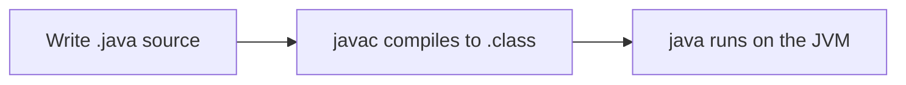

# Week 1 IDE conventions (IntelliJ + optional VS Code)

Use these paths and commands in every Week 1 lab. Everything in Week 1 runs on your **laptop**.

**Primary IDE:** IntelliJ IDEA Community Edition  
**Optional IDE:** VS Code (if you already prefer it)

Cohort shared services (PostgreSQL, Kafka, k3s) are documented in [`../FINAL-SETUP-README.md`](../FINAL-SETUP-README.md) and are **not required until Week 4+**.

## Workspace

| OS | Path |
| -- | ---- |
| Windows | `%USERPROFILE%\java-bootcamp` (example: `C:\Users\<you>\java-bootcamp`) |
| macOS | `~/java-bootcamp` |

Hands-on projects live under: `java-bootcamp/examples/` (Lab 0 `HelloJava`, then `lab1-answers`, `labN-crm`, …).  
Lab 0 evidence: `java-bootcamp/notes/screenshots/` (later labs often also use `examples/<lab>/notes/screenshots/`).

OS-specific Lab 0 setup:

- Windows → [`lab0/LAB-0-WINDOWS.md`](lab0/LAB-0-WINDOWS.md)
- macOS → [`lab0/LAB-0-MACOS.md`](lab0/LAB-0-MACOS.md)

## Choose an IDE

### IntelliJ IDEA Community (primary)

1. **File → Open…** → select the project folder (the folder that contains `src` or the `.java` files), or open `java-bootcamp`.
2. Trust the project if prompted.
3. **File → Project Structure → Project** → SDK = **21** (Temurin / OpenJDK 21); Language level = **21**.
4. Mark `src` as **Sources Root** when the lab uses a `src/` tree (right-click `src` → **Mark Directory as → Sources Root**).
5. Right-click a class with `main` → **Run ‘ClassName.main()’**, or use the green gutter arrow next to `main`.
6. Use the IntelliJ terminal (**View → Tool Windows → Terminal**) for `javac` / `java` / `mvn` when a lab asks for CLI proof.

### VS Code (optional)

1. **File → Open Folder…** → select `java-bootcamp` (or the lab’s project folder).
2. Confirm **Extension Pack for Java** is installed.
3. Open the integrated terminal: **Terminal → New Terminal**.
4. Run `javac` / `java` from that terminal in the project directory.

## Compile and run (terminal — both IDEs)

**Windows PowerShell** and **macOS Terminal** use the same `javac` / `java` once you `cd` into the project folder.

```text
# Packaged labs (Lab 2+)
javac -d out src/com/academy/.../*.java
java -cp out com.academy....Main

# Flat labs (Lab 1 / Lab 4 demos)
javac MyClass.java
java MyClass
```

| | Windows PowerShell | macOS |
| - | ------------------ | ----- |
| Go home workspace | `cd $env:USERPROFILE\java-bootcamp` | `cd ~/java-bootcamp` |
| List files | `Get-ChildItem` / `dir` | `ls` |
| Classpath separator | `;` (rare) or keep `-cp out` | `:` if combining jars |

## Per-lab OS guides

Each Week 1 lab folder includes:

| File | Use when |
| ---- | -------- |
| `LAB-N-GUIDE.md` | Full lab content (platform-neutral steps) |
| `LAB-N-WINDOWS.md` | Windows + IntelliJ (primary) how-to for that lab |
| `LAB-N-MACOS.md` | macOS + IntelliJ (primary) how-to for that lab |

## Diagram legend used in lab guides



## After Week 1

When labs need the shared host (`100.22.136.97`), use credentials from the instructor pack and follow [FINAL-SETUP-README.md](../FINAL-SETUP-README.md).
