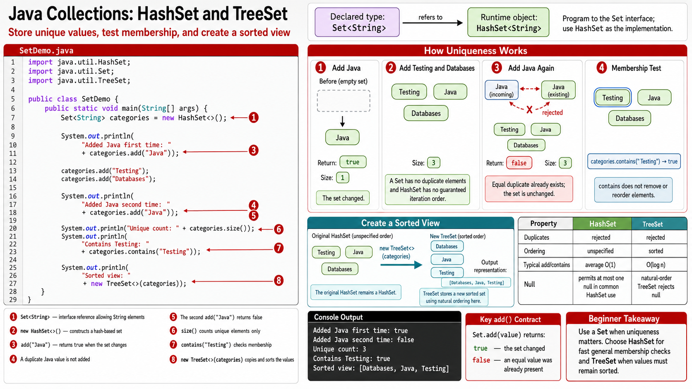

# Exercise 2 — Working with `HashSet`

**Module 5** · Pre-lab practice · then open [`../lab5/LAB-5-GUIDE.md`](../lab5/LAB-5-GUIDE.md)  
**Folder:** `examples/module-05-exercises/` ([setup](EXERCISES-INDEX.md))



## Goal

Create `SetDemo.java`, prove duplicate rejection with `add`’s return value, and create a sorted `TreeSet` view.

## Starter / reference

```java
import java.util.HashSet;
import java.util.Set;
import java.util.TreeSet;

public class SetDemo {
    public static void main(String[] args) {
        Set<String> categories = new HashSet<>();

        System.out.println(
                "Added Java first time: "
                + categories.add("Java"));

        categories.add("Testing");
        categories.add("Databases");

        System.out.println(
                "Added Java second time: "
                + categories.add("Java"));

        System.out.println(
                "Unique count: " + categories.size());
        System.out.println(
                "Contains Testing: "
                + categories.contains("Testing"));

        // HashSet order is unspecified; TreeSet sorts.
        System.out.println(
                "Sorted view: "
                + new TreeSet<>(categories));
    }
}
```

## `HashSet` vs `TreeSet`

| Property | `HashSet` | `TreeSet` |
| -------- | --------- | --------- |
| Duplicate values | Rejected | Rejected |
| Iteration order | Unspecified | Natural sorted order |
| Typical membership lookup | Fast average-case | Tree-based, typically `O(log n)` |
| Use here | Unique category registry | Sorted category report |

`Set.add(value)` returns:

- `true` when the set changed;
- `false` when an equal value was already present.

## Steps

### Step 1 — Compile and run

**Windows:**

```powershell
cd $env:USERPROFILE\java-bootcamp\examples\module-05-exercises
javac SetDemo.java
java SetDemo
```

**macOS:**

```bash
cd ~/java-bootcamp/examples/module-05-exercises
javac SetDemo.java
java SetDemo
```

**Verified (Windows):**

```text
Added Java first time: true
Added Java second time: false
Unique count: 3
Contains Testing: true
Sorted view: [Databases, Java, Testing]
```

### Step 2 — Explain what is deterministic

These are deterministic:

- second `"Java"` add returns `false`;
- size is `3`;
- sorted view is alphabetical.

Raw `HashSet` iteration order is **not** a contract and may vary by JDK or run.

### Step 3 — Connect to custom objects

Add to `notes.md`:

> Sets determine duplicates using `equals` and `hashCode`. Strings already implement them. Lab 5 must define identity carefully when custom objects are stored in sets.

## Expected result

The set contains three unique categories; the duplicate add returns `false`; `TreeSet` prints them sorted.

## If it fails

| Problem | Fix |
| ------- | --- |
| Expected insertion order from `HashSet` | Use `LinkedHashSet` only when insertion order is required |
| Expected sorted `HashSet` | Create a `TreeSet` view |
| Duplicate count is `4` | Ensure both values are exactly `"Java"` |

## Pass criteria

| # | Confirm | Your notes |
| - | ------- | ---------- |
| 1 | Duplicate add returns `false`; size remains `3` | Pass / Fail |
| 2 | Sorted view is `[Databases, Java, Testing]` | Pass / Fail |
| 3 | You do not rely on `HashSet` iteration order | Pass / Fail |
