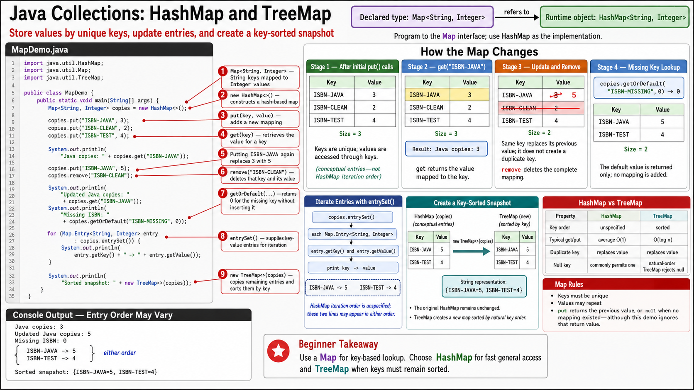

# Exercise 3 — Working with `HashMap`

**Module 5** · Pre-lab practice · then open [`../lab5/LAB-5-GUIDE.md`](../lab5/LAB-5-GUIDE.md)  
**Folder:** `examples/module-05-exercises/` ([setup](EXERCISES-INDEX.md))



## Goal

Create `MapDemo.java` using ISBN-like strings as keys and copy counts as values. Practice put, get, update, remove, default lookup, and entry iteration.

## Starter / reference

```java
import java.util.HashMap;
import java.util.Map;
import java.util.TreeMap;

public class MapDemo {
    public static void main(String[] args) {
        Map<String, Integer> copies = new HashMap<>();

        copies.put("ISBN-JAVA", 3);
        copies.put("ISBN-CLEAN", 2);
        copies.put("ISBN-TEST", 4);

        System.out.println(
                "Java copies: " + copies.get("ISBN-JAVA"));

        // Same key replaces its old value.
        copies.put("ISBN-JAVA", 5);
        copies.remove("ISBN-CLEAN");

        System.out.println(
                "Updated Java copies: "
                + copies.get("ISBN-JAVA"));
        System.out.println(
                "Missing ISBN: "
                + copies.getOrDefault("ISBN-MISSING", 0));

        // HashMap entry order is unspecified.
        for (Map.Entry<String, Integer> entry
                : copies.entrySet()) {
            System.out.println(
                    entry.getKey() + " -> " + entry.getValue());
        }

        // Deterministic key-sorted snapshot.
        System.out.println(
                "Sorted snapshot: " + new TreeMap<>(copies));
    }
}
```

## Operation guide

| Operation | Result |
| --------- | ------ |
| `put(newKey, value)` | Adds mapping |
| `put(existingKey, value)` | Replaces old value |
| `get(key)` | Value, or `null` if absent |
| `getOrDefault(key, default)` | Value or supplied fallback |
| `remove(key)` | Removes mapping |
| `entrySet()` | Key-value entries for iteration |

Map keys are unique; values do not need to be unique.

## Steps

### Step 1 — Compile and run

**Windows:**

```powershell
cd $env:USERPROFILE\java-bootcamp\examples\module-05-exercises
javac MapDemo.java
java MapDemo
```

**macOS:**

```bash
cd ~/java-bootcamp/examples/module-05-exercises
javac MapDemo.java
java MapDemo
```

**Verified values (entry order may differ):**

```text
Java copies: 3
Updated Java copies: 5
Missing ISBN: 0
ISBN-TEST -> 4
ISBN-JAVA -> 5
Sorted snapshot: {ISBN-JAVA=5, ISBN-TEST=4}
```

### Step 2 — Explain replacement

`put("ISBN-JAVA", 5)` does not create a duplicate key. It changes that key’s value from `3` to `5`.

### Step 3 — Compare absent lookups

Temporarily print:

```java
System.out.println(copies.get("ISBN-MISSING"));
```

It prints `null`; `getOrDefault(..., 0)` prints `0`. Remove the temporary line afterward.

## Expected result

The Java count updates to `5`, the clean-code key is removed, and the sorted snapshot contains two mappings.

## If it fails

| Problem | Fix |
| ------- | --- |
| Expected exact `HashMap` order | Only the `TreeMap` snapshot has sorted-key order |
| Missing lookup causes unboxing NPE | Use `getOrDefault` or test `containsKey` |
| Duplicate ISBN appears | A map cannot hold duplicate equal keys; `put` replaces |

## Pass criteria

| # | Confirm | Your notes |
| - | ------- | ---------- |
| 1 | Java count changes from `3` to `5` | Pass / Fail |
| 2 | Missing ISBN safely reports `0` | Pass / Fail |
| 3 | You can explain key uniqueness and unspecified order | Pass / Fail |
