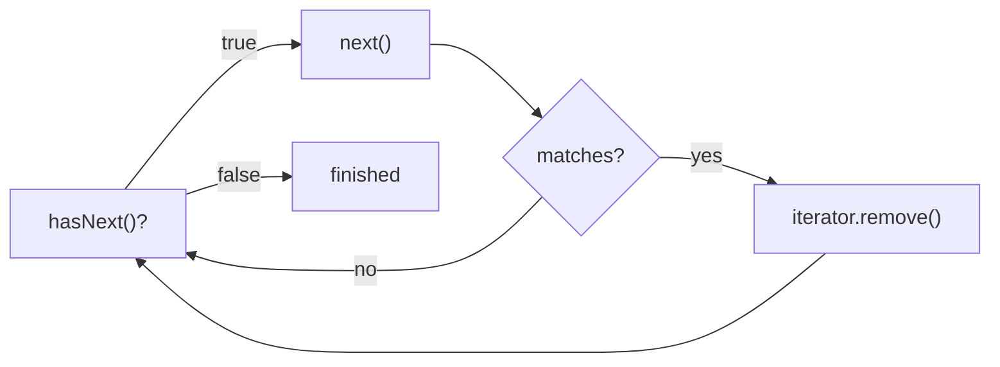

# Exercise 5 — Safe Removal During Iteration

**Module 5** · Pre-lab practice · then open [`../lab5/LAB-5-GUIDE.md`](../lab5/LAB-5-GUIDE.md)  
**Folder:** `examples/module-05-exercises/` ([setup](EXERCISES-INDEX.md))

## Goal

Create `IteratorDemo.java` and safely remove matching titles through the active `Iterator`.

## Starter / reference

```java
import java.util.ArrayList;
import java.util.Iterator;
import java.util.List;

public class IteratorDemo {
    public static void main(String[] args) {
        List<String> titles = new ArrayList<>(List.of(
                "Java 21",
                "Deprecated Java 8 Notes",
                "Clean Code",
                "Deprecated API Guide"
        ));

        Iterator<String> iterator = titles.iterator();

        while (iterator.hasNext()) {
            String title = iterator.next();

            if (title.startsWith("Deprecated")) {
                // Remove the element most recently returned by next().
                iterator.remove();
            }
        }

        System.out.println("Remaining: " + titles);
    }
}
```

## Iterator protocol



| Method | Rule |
| ------ | ---- |
| `hasNext()` | Check before reading |
| `next()` | Advance and return one item |
| `iterator.remove()` | Remove the item returned by the latest `next()` |
| `titles.remove(...)` inside this loop | Unsafe structural modification |

## Steps

### Step 1 — Compile and run

**Windows:**

```powershell
cd $env:USERPROFILE\java-bootcamp\examples\module-05-exercises
javac IteratorDemo.java
java IteratorDemo
```

**macOS:**

```bash
cd ~/java-bootcamp/examples/module-05-exercises
javac IteratorDemo.java
java IteratorDemo
```

**Verified (Windows):**

```text
Remaining: [Java 21, Clean Code]
```

### Step 2 — Run the failure experiment

Replace:

```java
iterator.remove();
```

with:

```java
titles.remove(title);
```

Run again. A `ConcurrentModificationException` is expected because the list is structurally modified outside the iterator while iteration is active.

Restore `iterator.remove()` before continuing.

### Step 3 — Know the simpler alternative

For this specific condition, Java also supports:

```java
titles.removeIf(
        title -> title.startsWith("Deprecated"));
```

This exercise uses `Iterator` because Lab 5 requires understanding its safe-removal contract.

## Expected result

Both deprecated titles are removed without `ConcurrentModificationException`.

## If it fails

| Problem | Fix |
| ------- | --- |
| `UnsupportedOperationException` | Wrap `List.of(...)` in `new ArrayList<>(...)` |
| `IllegalStateException` from remove | Call `next()` before each `iterator.remove()` |
| Concurrent modification | Remove through the iterator, not the list |

## Pass criteria

| # | Confirm | Your notes |
| - | ------- | ---------- |
| 1 | Remaining list is `[Java 21, Clean Code]` | Pass / Fail |
| 2 | Failure experiment produces concurrent-modification evidence | Pass / Fail |
| 3 | You can explain the iterator remove protocol | Pass / Fail |
