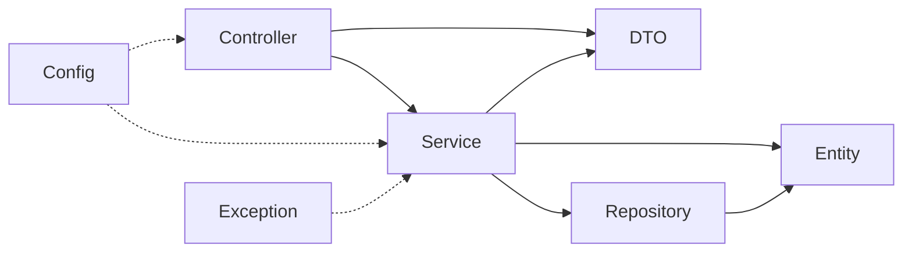

## Exercise-05-dependency-direction:

### Intended flow



### Mark each dependency

Use **Acceptable**, **Problematic**, or **Needs context**:

| Dependency | Decision      | Why                                                                  |
| ---------- |---------------|----------------------------------------------------------------------|
| controller → service | Acceptable    |                                                                      |
| service → repository | Acceptable    |                                                                      |
| repository → entity | Acceptable    |                                                                      |
| entity → controller | Problematic   | domain depends on transport                                          |
| repository → controller | Problematic   | persistence depends on presentation                                  |
| service → DTO | Needs context | acceptable in this lab's simple mapping, but avoid transport leakage |
| DTO → repository | Problematic   | boundary model should not perform storage                            |

### Detect a cycle

Bad:

```text
controller → service → repository → controller
```

Why: changes can ripple both directions, isolated tests become harder, and package ownership is unclear.

Repair:

```text
controller → service → repository → entity
```

### Write one architecture rule

```markdown
Higher-level request handling may call inward services and repositories.
Domain/entity and repository packages must not import controller classes.
```

**Expected result:** You identify inward flow, two clear violations, one context-sensitive dependency, and one cycle repair.


