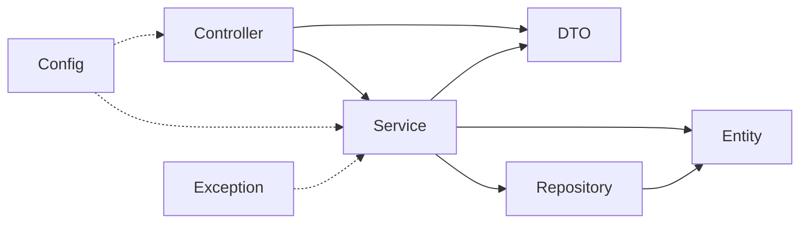

# Exercise 5 — Check Dependency Direction

**Module 8** · Architecture exercise · [setup](EXERCISES-INDEX.md)

## Goal

Identify acceptable and problematic package dependencies before they become circular architecture.

## Intended flow



## Steps

### Step 1 — Mark each dependency

Use **Acceptable**, **Problematic**, or **Needs context**:

| Dependency | Decision | Why |
| ---------- | -------- | --- |
| controller → service | | |
| service → repository | | |
| repository → entity | | |
| entity → controller | | |
| repository → controller | | |
| service → DTO | | |
| DTO → repository | | |

### Step 2 — Check the reference

| Dependency | Decision |
| ---------- | -------- |
| controller → service | Acceptable |
| service → repository | Acceptable |
| repository → entity | Acceptable |
| entity → controller | Problematic: domain depends on transport |
| repository → controller | Problematic: persistence depends on presentation |
| service → DTO | Needs context; acceptable in this lab’s simple mapping, but avoid transport leakage |
| DTO → repository | Problematic: boundary model should not perform storage |

### Step 3 — Detect a cycle

Bad:

```text
controller → service → repository → controller
```

Explain why: changes can ripple both directions, isolated tests become harder, and package ownership is unclear.

Repair:

```text
controller → service → repository → entity
```

### Step 4 — Write one architecture rule

Add to `architecture-rules.md`:

```markdown
Higher-level request handling may call inward services and repositories.
Domain/entity and repository packages must not import controller classes.
```

## Expected result

You identify inward flow, two clear violations, one context-sensitive dependency, and one cycle repair.

## Pass criteria

| # | Confirm | Notes |
| - | ------- | ----- |
| 1 | Seven dependencies classified | Pass / Fail |
| 2 | Cycle is repaired | Pass / Fail |
| 3 | Architecture rule is written | Pass / Fail |
