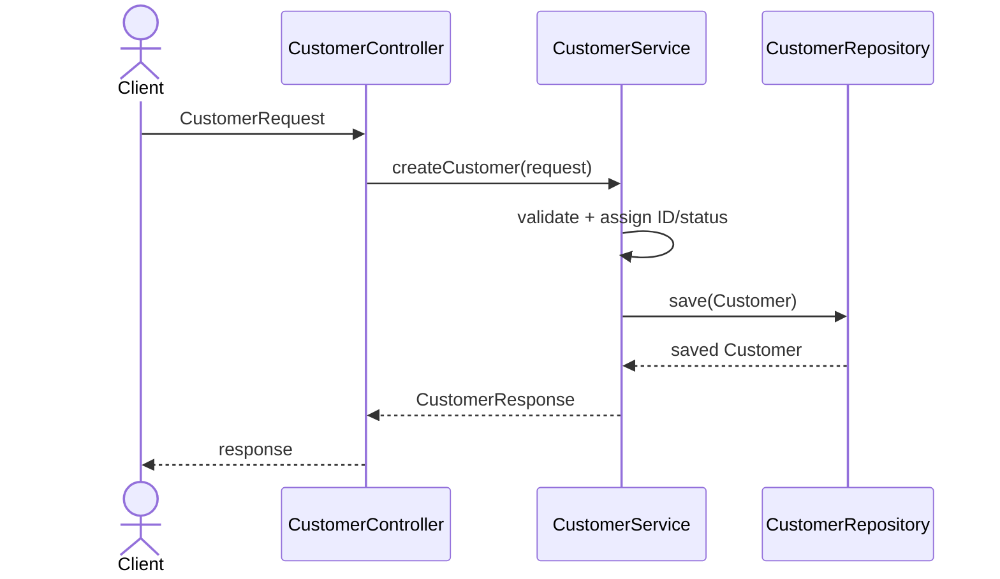
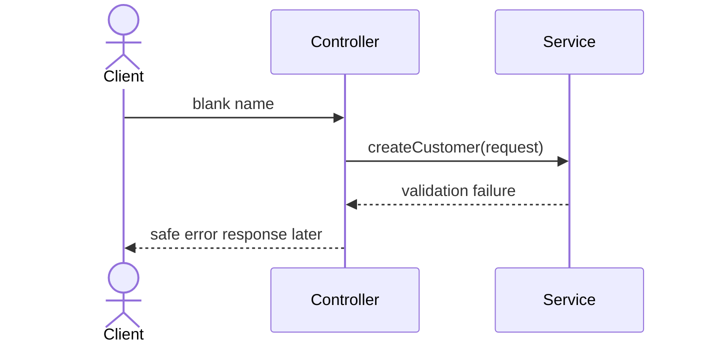

# Exercise 6 — Trace a Customer Request

**Module 8** · Documentation exercise · then start [`../lab8/LAB-8-GUIDE.md`](../lab8/LAB-8-GUIDE.md)

## Goal

Create `customer-request-flow.md` showing how a future request to create customer `CUS-1001` moves through layers—without implementing HTTP or persistence.

## Scenario

Future input:

```text
Name: Amina Khan
Email: amina@example.test
Requested status: ACTIVE
Correlation ID: lab-request-001
```

## Steps

### Step 1 — Create the flow



### Step 2 — Annotate transformations

| Boundary | Input | Output |
| -------- | ----- | ------ |
| Client → controller | Future transport payload | `CustomerRequest` |
| Service validation | Request DTO | valid domain values |
| Service → repository | `Customer` entity | saved entity |
| Service → controller | entity/result | `CustomerResponse` |

### Step 3 — Add failure flow



Do not invent HTTP status codes yet; Module 8 is structure only.

### Step 4 — Add “now vs later”

```markdown
## Now
- Package names and stub responsibilities
- Plain Java types that compile
- Documented flow

## Later
- Spring controller annotations
- Validation annotations
- Repository implementation/JPA
- HTTP response mapping
- Correlation-ID logging
```

### Step 5 — Final readiness check

Record **Pass** or **Fail** in your notes:

| Readiness check | Result |
| --------------- | ------ |
| I can locate each class package | Pass / Fail |
| I can explain controller → service → repository | Pass / Fail |
| I distinguish DTO from entity | Pass / Fail |
| I have not added Spring/JPA/database code | Pass / Fail |
| I am ready to build the full Maven skeleton in Lab 8 | Pass / Fail |

## Expected result

One document contains success/failure flows, object transformations, and a truthful now/later boundary.

## Pass criteria

| # | Confirm | Notes |
| - | ------- | ----- |
| 1 | Success flow includes all three layers | Pass / Fail |
| 2 | Failure stops before repository | Pass / Fail |
| 3 | Request/entity/response transformations are identified | Pass / Fail |
| 4 | No premature Spring/JPA implementation appears | Pass / Fail |
